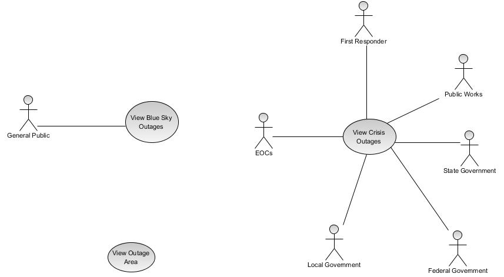

#Open Power Status Use Cases
The following use cases are intended to help identify the various audience and their respective needs as they related to power outage information. The use cases will form the basis of requirements intended to be met by the Outage Data Initiative data standard.

